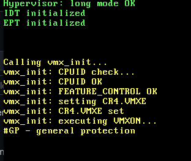

# Hypervisor

Минимальный Type-1 (bare-metal) гипервизор для x86-64 с поддержкой Intel VT-x. Загружается через GRUB (Multiboot v1), переходит в Long Mode, инициализирует IDT, EPT и пытается войти в VMX operation.



## Возможности

- Multiboot v1 (загрузка через GRUB)
- Переход 32-bit protected mode → 64-bit Long Mode
- Identity-mapped page tables (первые 1 GiB через 2 MiB huge pages)
- IDT с обработчиками исключений (`#DE`, `#UD`, `#GP`, `#PF`, `#VC`)
- Extended Page Tables (EPT) — identity map первых 2 MiB
- VMXON / VMCLEAR / VMPTRLD / VMWRITE
- VMLAUNCH — только каркас (VM-Exit handler-заглушка)

## Требования

- `nasm`, `g++` (поддержка `-m64`), `ld`, `grub-mkrescue`, `qemu-system-x86_64`
- Процессор с **Intel VT-x** (или AMD-V с соответствующей адаптацией)
- Включённая виртуализация в BIOS/UEFI

## Сборка

```bash
make
```

Собирает `obj/kernel.bin`, копирует его в `Hypervisor/boot/` и создаёт `Hypervisor.iso` через `grub-mkrescue`.

## Запуск

```bash
qemu-system-x86_64 -m 1024 -cdrom Hypervisor.iso -cpu max -enable-kvm
```

### Проверка nested virtualization на хосте

```bash
cat /sys/module/kvm_intel/parameters/nested   # должно быть Y
```

Если `N`:

```bash
sudo modprobe -r kvm_intel && sudo modprobe kvm_intel nested=1
```

## Известные ограничения

- `VMLAUNCH` не выполняет реального запуска гостя — отсутствуют MSR bitmaps, полноценный VM-Exit handler, обработка EPT violation.
- VMCS control fields корректируются по allowed-1 битам, но не все обязательные поля инициализированы.
- Один процессор (нет VMXON для каждого ядра).
- Нет аллокатора — все буферы статические в `.bss`.
- `VMXON` может возвращать `#GP` в окружениях, где KVM не пробрасывает `IA32_FEATURE_CONTROL` с битом 2.

## Отладка

Если экран замирает без сообщений — проверьте, что `idt_init()` вызывается до `vmx_init()`. Для пошаговой диагностики используются `hv_debug()` и `hv_debug_hex()` (реализованы в `kernel.cpp`), выводящие сообщения жёлтым/голубым цветом на VGA.
